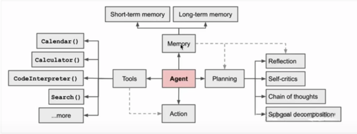

## Agents是什么
大语言模型可以接受输入，可以分析 & 推理，可以输出文字，代码，媒体，然而，其无法像人类一样思考，拥有规划思考的能力，运用各种工具与物理世界互动，以及拥有人类的记忆能力
AI Agents是基于LLM能够自主理解、自主规划决策、执行复杂任务的智能体。
Agents的设计目的是为了处理那些简单的语言模型可能无法直接解决的问题，尤其是当这些任务涉及到多个步骤或者需要外部数据源的情况。

```md
LLM：接受输入、思考、输出
人类：LLM(接受输入、思考、输出) + 记忆 + 工具 + 规划 ----> agents 
```

